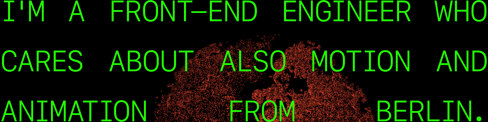

# Hi 👋🏼

I like to develop things.

I'm a Front-end Engineer at [Homeday](https://www.homeday.de/de/) a company that makes it quick and straightforward to sell/buy a house in Germany. Currently, I'm working on [My Homeday App](https://my.homeday.de/login) which is entirely structured with Vue. I love Vue but also dabble in React sometimes. 
 
- 👨🏼‍💻 I’m currently working with WebGL for a side project.
- 🌱 I’m currently learning the main purpose of the bundle approach on javascript. 
- 📫 How to reach me: arayuzgelistirici@gmail.com

<!--
**volcanioo/volcanioo** is a ✨ _special_ ✨ repository because its `README.md` (this file) appears on your GitHub profile.

- 🔭 I’m currently working on ...
- 🌱 I’m currently learning ...
- 👯 I’m looking to collaborate on ...
- 🤔 I’m looking for help with ...
- 💬 Ask me about ...
- 📫 How to reach me: ...
- 😄 Pronouns: ...
- ⚡ Fun fact: ...
-->
