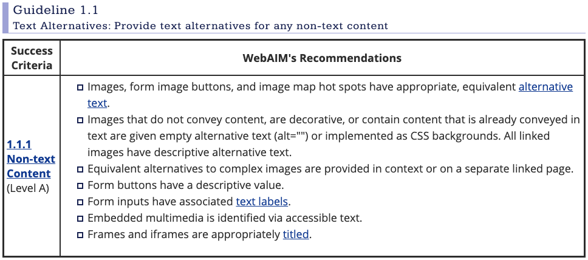

# Web Accessibility
* [What did I understand?](#what-did-I-understand)
	* [Facts](#facts)
	* [Why developers should care? ](#why-developers-should-care) `WIP`
	* [How developers care?](#how-developers-care)
* [Accessible Web for Everyone](#accessible-web-for-everyone)
	* [WebAIM Checklist](#webaim-checklist)
* [Impressions](#impressions)
* [Resources](#resources)

# What did I understand?
Web Accessibility means people with disabilities can perceive, understand, navigate and interact with the Web. One of the purposes is to make them can **contribute** to the Web. 

There are similar terms to web accessibility, such as UI, UX, Design, Internationalisation. The other term is Web Performance, which aims to fix slow connection issues. So, these terms are very similar but not the same fields. 

For this reason, In general, the medium posts or tutorials that tell people about web accessibility aim to reflect the difference between accessibility and what the developer thinks about accessibility. 

## Facts
There are plenty amount of facts to show why web accessibility is one of the important fields of Web Development.

1. 1 in 6 people is moderately or severely disabled in the world.
2. 15% of the World Population with up to 190 million (3.8%) people aged 15 years and older having significant difficulties in functioning, often requiring healthcare services.
3. **People with disabilities can live and participate in the community. They can become potential users.**

## Why developers should care? 
> "If we don't make it accessible, then we make it inaccessible." [(*5)](#resources)

Human Rights, [Legal Restrictions](https://www.w3.org/WAI/policies/ "Legal Restrictions") and the opportunity of transforming %15 of the local population to potential users. 

`WIP`

# Accessible Web for Everyone

**
 If you don't make it accessible, you make it inaccessible.
**

I heard these words in a tutorial of Jon Kuperman. That was a striking detail for me, 'cause there is a reality that if a developer doesn't add an `alt` attribute to a `` tag, that image indicates a content issue for assistive technologies. That makes the image inaccessible. 

> The purpose of this technique is to show how images can be marked so that they can be ignored by Assistive Technology. If no title attribute is used, and the alt text is set to null (i.e. alt="") it indicates to assistive technology that the image can be safely ignored. [(*6)](#resources)

W3C has huge documentation that provides general standards about accessibility. There is an organization called WebAIM that provides web accessibility resources since 1999 and one of the most important resources is WebAIM Checklist.

There are a couple of different organizations/communities that provides various tools/resources, such as;

* [WebAIM Checklist](#webaim-checklist)
* [WAVE Web Accessibility Evaluation Tool](https://wave.webaim.org//) `WIP`
* [The A11Y Project](https://www.a11yproject.com/) `WIP`
* [HTML5 Accessibility](http://html5accessibility.com/)
* [Accecible Colors](https://accessible-colors.com/)
* [Mozilla Accessibility](https://developer.mozilla.org/en-US/docs/Web/Accessibility)

## WebAIM Checklist
[WebAIM Checklist](https://webaim.org/standards/wcag/checklist) is a guideline that provides the most important action items of W3C Accessibility specs. The guideline split accessibility standards into 4 main sections;

* **Perceivable**: Web content is made available to the senses - sight, hearing, and/or touch.
* **Operable**: forms, controls, and navigation are operable.
* **Understandable**: Information and the operation of user interface must be understandable.
* **Robust**: Content must be robust enough that it can be interpreted by a wide variety of user agents, **including assistive technologies.**

Each section includes different checklists that change by the web content. So, (I think we can say:) web content has a significant role in web accessibility. One of the important sections is perceivable section that has 4 different checklists for specific websites such as;

* Text Alternatives: Provide text alternatives for any non-text content
* Time-based Media: Provide alternatives for time-based media
* Adaptable: Create content that can be presented in different ways (for example simpler layout) without losing information or structure
* Distinguishable: Make it easier for users to see and hear content including separating foreground from background

# Impressions
Oh! Accessibility is a huge topic than what I expected. I love it! In general, it seems a susceptible topic to me. Here is a small paragraph that I really liked from [On Accessibility and the Lack of Proper HTML by Ian Devlin](https://iandevlin.com/blog/2016/01/opinion/on-accessibility-and-the-lack-of-proper-html/ "(*1)").
 
> That one word can make web developers scream and run for cover or turn a deaf ear and a blind eye (no puns intended) in its general direction. Making sites accessible is also very important, but no matter how many people, regardless of who they are, talk about the importance of making websites more accessible, they are largely ignored. No-one cheers, no-one embraces what is said, and many don’t bother to build their sites with accessibility in mind.

> But why is this? Why do developers ignore those who would benefit from their websites being more accessible? Are they not people too? Do they really want to actively shun these people from accessing their website’s content and use it the way that they need? Is this a conscious decision made by web developers? Is it laziness? Ignorance? Fear? Or do developers simply decide that the number of people who would benefit from such accessibility are, like IE8 users, simply not worth the hassle?

:o

# Resources

1. https://www.w3.org/TR/WCAG20/
2. https://wave.webaim.org/
3. https://developer.mozilla.org/en-US/docs/Web/Accessibility
4. https://www.w3.org/WAI/policies/
5. https://frontendmasters.com/courses/web-accessibility/introduction/
6. https://www.w3.org/TR/WCAG20-TECHS/H67.html
7. https://iandevlin.com/blog/2016/01/opinion/on-accessibility-and-the-lack-of-proper-html/
8. https://www.iandevlin.com/blog/2016/01/opinion/on-accessibility-and-the-lack-of-proper-html/
9. https://dev.to/temmietope/web-accessibility-building-website-for-everyone-2a5b
10. https://medium.com/fed-or-dead/let-s-try-harder-with-web-accessibility-1d1a8db7afc0
11. https://twitter.com/stackblitz/status/1323267096512405505
12. https://www.a11yproject.com/checklist/#toc_Success-criteria
13. https://accessible-colors.com/
14. https://www.a11yproject.com/
15. http://html5accessibility.com/
